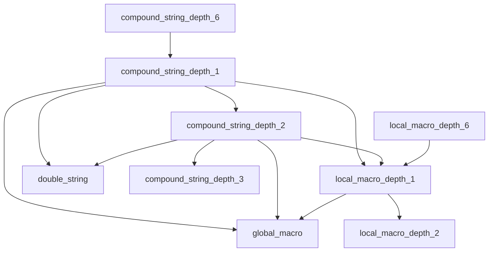

# Design Document: String-Macro Disambiguation

## Overview

This design addresses the challenge of correctly parsing Stata's string types and local macros, which share delimiter characters. The key insight is that the grammar must use token precedence and careful rule ordering to ensure that compound strings (`` `"..."' ``) are recognized before local macros (`` `name' ``), since the compound string opener `` `" `` is a superset of the local macro opener `` ` ``.

The current grammar already implements depth-encoded rules for both compound strings and local macros, but this design verifies the disambiguation logic and adds comprehensive test coverage.

## Architecture

### Parser Flow

```mermaid
flowchart TD
    A[Input: backtick character] --> B{Next char is double quote?}
    B -->|Yes: `"| C[Parse as compound_string_depth_N]
    B -->|No: `x| D[Parse as local_macro_depth_N]
    
    C --> E[Scan for compound content]
    E --> F{Found nested `"?}
    F -->|Yes| G[Recurse to depth N+1]
    F -->|No| H{Found `x'?}
    H -->|Yes| I[Parse nested local_macro]
    H -->|No| J{Found $name?}
    J -->|Yes| K[Parse nested global_macro]
    J -->|No| L[Continue scanning text]
    
    G --> E
    I --> E
    K --> E
    L --> M{Found "'?}
    M -->|Yes| N[Complete compound_string]
    M -->|No| E
    
    D --> O[Scan for macro name]
    O --> P{Found closing '?}
    P -->|Yes| Q[Complete local_macro]
    P -->|No| R[Error: unclosed macro]
```

### Disambiguation Strategy

The grammar relies on tree-sitter's longest-match semantics and rule ordering:

1. **Token Priority**: The compound string opener `` `" `` (two characters) takes precedence over the local macro opener `` ` `` (one character) because tree-sitter prefers longer matches
2. **Rule Structure**: Compound string rules explicitly start with `'`"'` as a single token, ensuring the parser commits to compound string parsing when it sees this sequence
3. **Depth Encoding**: Both compound strings and local macros use depth-encoded rules (1-6) to handle nesting, with wrap-around at depth 6

## Components and Interfaces

### Grammar Rules

#### Compound String Rules (Existing)

```javascript
compound_string_depth_1: $ => seq(
    '`"',                           // Opening delimiter (2-char token)
    repeat($._compound_content_1),  // Content including nested constructs
    "\"'",                          // Closing delimiter (2-char token)
),

_compound_content_1: $ => choice(
    $.compound_string_depth_2,      // Nested compound string (next depth)
    $.local_macro_depth_1,          // Embedded local macro
    $.global_macro,                 // Embedded global macro
    $.double_string,                // Embedded double string
    $._compound_text,               // Plain text content
),
```

#### Local Macro Rules (Existing)

```javascript
local_macro_depth_1: $ => seq(
    '`',                            // Opening delimiter (1-char token)
    choice(
        $.local_macro_depth_2,      // Nested local macro
        $.global_macro,             // Embedded global macro
        $._macro_name,              // Macro identifier
    ),
    "'",                            // Closing delimiter
),
```

#### Key Disambiguation Point

The critical disambiguation happens because:
- `` `" `` is a 2-character token in compound string rules
- `` ` `` is a 1-character token in local macro rules
- Tree-sitter's lexer prefers longer matches, so `` `" `` wins when followed by a double quote

### Test Corpus Structure

New test cases will be added to `tree-sitter-stata/test/corpus/stata.txt` following the existing format:

```
========================================
Test Name
========================================
<stata code>

---

(expected_ast)
```

## Data Models

### AST Node Types

The grammar produces these node types for strings and macros:

| Node Type | Delimiters | Contains |
|-----------|------------|----------|
| `double_string` | `"..."` | text, global_macro, escape sequences |
| `compound_string_depth_1` | `` `"..."' `` | text, nested strings, local/global macros |
| `compound_string_depth_2` | `` `"..."' `` | (same, at depth 2) |
| ... | ... | ... |
| `compound_string_depth_6` | `` `"..."' `` | (same, wraps to depth 1) |
| `local_macro_depth_1` | `` `...' `` | identifier, nested macros, global_macro |
| `local_macro_depth_2` | `` `...' `` | (same, at depth 2) |
| ... | ... | ... |
| `local_macro_depth_6` | `` `...' `` | (same, wraps to depth 1) |
| `global_macro` | `$name` or `${name}` | identifier |

### Nesting Relationships




## Correctness Properties

*A property is a characteristic or behavior that should hold true across all valid executions of a system—essentially, a formal statement about what the system should do. Properties serve as the bridge between human-readable specifications and machine-verifiable correctness guarantees.*

Based on the acceptance criteria analysis, the following properties define the correctness of the string-macro disambiguation:

### Property 1: Compound String vs Local Macro Disambiguation

*For any* input string starting with `` ` ``, if the next character is `"` then the parser SHALL produce a `compound_string_depth_N` node, otherwise it SHALL produce a `local_macro_depth_N` node (assuming valid syntax).

**Validates: Requirements 1.1, 1.3, 1.4**

This is the fundamental disambiguation property. The grammar must correctly distinguish:
- `` `"anything"' `` → compound_string
- `` `name' `` → local_macro

### Property 2: Local Macros Inside Compound Strings

*For any* compound string containing one or more local macro references (`` `name' `` patterns), the parser SHALL produce a `compound_string_depth_N` node containing `local_macro_depth_N` child nodes for each embedded macro.

**Validates: Requirements 2.1, 2.3**

This property ensures that local macros are correctly recognized and parsed as nested nodes within compound strings, not as part of the string text.

### Property 3: Global Macros Inside Compound Strings

*For any* compound string containing global macro references (`$name` or `${name}` patterns), the parser SHALL produce a `compound_string_depth_N` node containing `global_macro` child nodes for each embedded macro.

**Validates: Requirements 3.1, 3.2**

This property ensures both global macro syntaxes are recognized within compound strings.

### Property 4: Nested Compound String Depth Tracking

*For any* nested compound string structure, the parser SHALL assign depth levels such that each nested compound string has depth = (parent_depth % 6) + 1, with wrap-around from depth 6 to depth 1.

**Validates: Requirements 4.1, 4.3, 4.4**

This property ensures the depth encoding correctly tracks nesting levels and handles the wrap-around case.

### Property 5: Double String Parsing with Embedded Content

*For any* double-quoted string containing global macros, escaped quotes, or plain text, the parser SHALL produce a `double_string` node with appropriate child nodes for global macros and the text content preserved.

**Validates: Requirements 5.1, 5.2, 5.3**

This property ensures double strings are parsed correctly with their embedded content.

### Property 6: Local Macros Not Parsed Inside Double Strings

*For any* double-quoted string containing the character sequence `` `name' ``, the parser SHALL NOT produce a `local_macro_depth_N` child node; instead, the backtick and apostrophe SHALL be treated as literal string content.

**Validates: Requirements 5.4**

This is a negative property ensuring that local macro syntax is not recognized inside double strings (only compound strings support local macro embedding).

## Error Handling

### Parse Errors

| Scenario | Expected Behavior |
|----------|-------------------|
| Unclosed compound string (`` `"text `` without `"'`) | Parser produces ERROR node |
| Unclosed local macro (`` `name `` without `'`) | Parser produces ERROR node |
| Unclosed double string (`"text` without closing `"`) | Parser produces ERROR node |
| Mismatched delimiters (`` `"text' ``) | Parser produces ERROR node or partial match |

### Recovery Strategy

Tree-sitter's error recovery will attempt to:
1. Find the nearest valid closing delimiter
2. Produce partial AST nodes where possible
3. Mark unrecoverable sections as ERROR nodes

## Testing Strategy

### Dual Testing Approach

Testing will use both unit tests (specific examples) and property-based tests (universal properties):

1. **Unit Tests**: Verify specific examples from the requirements
   - Compound string basic case: `` `"hello"' ``
   - Local macro basic case: `` `name' ``
   - Disambiguation case: `` `"merp"' `` vs `` `merp' ``
   - Nested structures at various depths

2. **Property-Based Tests**: Verify universal properties across generated inputs
   - Generate random valid compound strings and verify node types
   - Generate random valid local macros and verify node types
   - Generate nested structures and verify depth assignments

### Test Corpus Structure

The test corpus (`tree-sitter-stata/test/corpus/stata.txt`) will include new sections:

```
========================================
String-Macro Disambiguation
========================================
[test cases for disambiguation]

========================================
Nested Compound Strings
========================================
[test cases for nesting]

========================================
Macros Inside Strings
========================================
[test cases for embedded macros]
```

### Property-Based Testing Configuration

- **Library**: fast-check (already in node_modules)
- **Minimum iterations**: 100 per property test
- **Test location**: `tree-sitter-stata/tests/property/`
- **Tag format**: `Feature: string-macro-disambiguation, Property N: <property_text>`

### Test Execution

```bash
# Run tree-sitter corpus tests
cd tree-sitter-stata
npx tree-sitter test

# Run property-based tests
npm test
```
